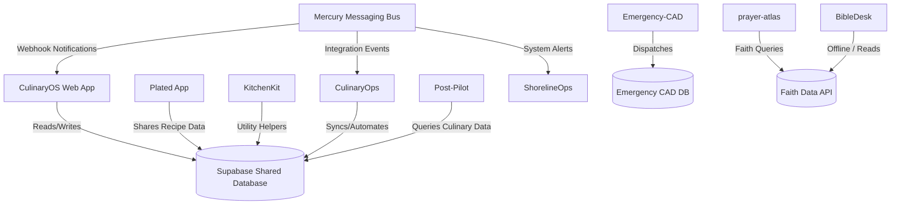

# 🔗 Ecosystem Architecture

This document describes how all projects in the ShadowWalkerNC ecosystem interact, share authentication, route data, and integrate via MCP (Model Context Protocol) bridges.

## 🌉 Integration Topology

## 🔐 Shared Authentication & Boundaries

### 1. Culinary Suite (Supabase Auth)
- **Shared Realm**: CulinaryOS, Plated, KitchenKit, CulinaryOps, and Post-Pilot share a common Supabase project boundary.
- **Single Sign-On (SSO)**: Users sign in once via CulinaryOS. OAuth and email/password tokens are shared across subdomains.

### 2. Platform Messaging (Mercury)
- **API Keys / JWTs**: System-to-system auth using secure webhook signatures. Services registering with Mercury require a verified signing secret.

### 3. Care & Safety (ShorelineOps / Emergency-CAD)
- **Isolated Datastores**: These systems run in decoupled environments with stricter data privacy controls. No direct database access from the Culinary suite.

## ⚡ MCP Bridges

Model Context Protocol (MCP) servers allow AI tools to interact securely across our projects.

- **`mcp-culinary-server`**: Connected to the Culinary Supabase database. Enables AI agents to read/update menus, recipes, and operations.
- **`mcp-mercury-bridge`**: Exposes messaging routes so agents can verify service status or send test notifications.
- **`mcp-emergency-cad`**: Provides read-only query APIs for CAD state analysis.
